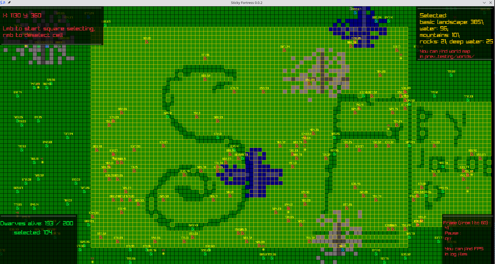

# Sticky Fortress

<p align="center">
  
  
  
</p>

Clone of dwarf fortress on C with using Raylib - fast, clear, easy to scale. 



## Features

- **Map generation** - **procedurally generates** world with grass, mountains, water and objects: dwarves and food
- **Autonomous dwarves** - they random moving, **finding food** and diyng without your control
- **Selecting and stats** - you can select any cells or objects and watch for world's **stats**
- **Logging and world saving** - program writes main events with **timestamps** in **log files**. Before closing window data about world **cells** and **objects** writes in **world file**

## Build
> At the moment program's `Makefile` works only on Linux.

1) Clone this git repository:
    ```sh
    git clone https://github.com/fedor-pro/Sticky_Fortress.git
    ```

2) Install raylib following these instructions:
    ```
    https://github.com/raysan5/raylib/wiki/Working-on-GNU-Linux
    ```

3) Navigate to the project directory:
    ```sh
    cd Sticky_Fortress/prevTesting
    ```

4) Clean all compile results if they are with using `make`
    ```sh
    make clean
    ```

4) Build & run project using `make`
    ```sh
    make crun
    ```
    or, if you want save executable file:
    ```sh
    make crun
    ```

### Common errors

1) Programm compilation crashed with `Makefile` ERROR `src/run/draw.o: in function «draw_gui_pannel»: draw.c:(.text+0x1e): undefined reference to DrawRectangle'` OR SIMILAR: check that you have Linux and Raylib downloaded

## Usage

Program will start. Dwarves(green symbols `&`) randomly going around the map, and when they get hungry after a while, they go to nearest food(yellow symbols `*`) and restore their hunger.
Press `Lmb` to start square selecting, move mouse to end square position and press `Lmb` again. For start new square selecting just click at any cell. For deselect a specific cell press `Rmb`, or
`Esc` for deselect all map. Press `space` for pause and `q` for exit from window.

## Project structure

```
.
├── prev_testing            # Main program files
|   |
|   └── Makefile
|   └── plan.md             # Project development plan with completed and planned tasks and autor's 
|   |                           wishlists (at the moment available only russian version of this document)
|   |
│   └── images/             # Service and example images
│   └── logs/, worlds/      # Logging files and world saves
|   |
│   └── src/                
|       |
│       └── main.c          # Core logic: initialization, drawing, selecting...
|       |
|       └── include/, run/
|                   |
|                   └── datalord.h/c # Initialization and undefining datalords - containers for
|                   |                   service data from all program
|                   └── updatelord.h/c # Updating manager
|                   |
|                   └── dwarves.h/c # Dwarves updating logic
|                   └── generate.h/c # Creating world structures
|                   |
|                   |
|                   └── uilord.h/c # User interface manager
|                   └── world.h/c # Main module, contains map, objects and landscapes. It managing
|                   |               creation, filling, saving to file and destruction of the world
|                   |
|                   └── logging.h/c # Functions for writing data in log file
|                   └── draw.h/c # Helper rendering functions
|                   └── spawn.h/c # Stub module    
```