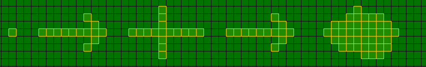

> Разработка начата: 13.11.2025

# ver 0.01: -- стартовая -- ✔
> С этой версии все началось

1) Базовый код с двумерным массивом, взаимодействием с мышкой, и типами ландшавтов ✔

2) Процедурная генерация мира ✔

3) Обязательно разобраться с компиляцией и разделить код на модули ✔

4) Симуляция ✔
   1. Дварфы ✔
   2. Еда ✔

5) Улучшение симуляции ✔
   1. Добавление потребностей, поиска еды и смерти от голода ✔
   2. Enum поведение и направления движения ✔

6) Логирование ✔

7) Рефакторинг и изменение кода: ✔
   1. Перенести хранение дварфов и карты мира из стека в кучу: ✔

8) Нововведния и расшерение: ✔
   1. Добавить `items` ✔
      1. Надо будет сделать отдельный struct с enum типом ✔
      2. Хранить массив таких структов в `world` ✔
      3. Сделать еду предметами ✔
      4. Обновить логику дварфов с учетом новой системы ✔

8) Улучшение моментов ✔
   1. Улучшить генерацию: ✔
      1. Найти баланс между параметрами и шаблонизировать их ✔
      2. Исправить появление дварфов в воде ✔
      3. Исправить наложение структур при генерации ✔
      4. Добавить скалы в алгоритм генерации ✔

   1. Улучшить архитектуру создания и хранения мира: ✔
      1. Хранить все landscape_typ'ы в `world` ✔
      2. Сделать функцию для спавна дварфа ✔

   1. Улучшить интерфейс: ✔
      1. Сделать аналог `world` для хранения всех элементов интерфейса (назвать `ui_lord`) ✔
         1. Сделать отдельный модуль с функцией инициализации (что бы не захламлять `main.c` созданием интерфейса) ✔

> Итог: версия ver 0.01 завершена  
> Потрачено: 5 месяцев 18 дней  
> Строк кода: 1090 включая все include

# ver 0.02 -- улучшение quality of code:
> Теперь, когда основной фундамент построен, код нужно привести в порядок  
> и подготовить прочную платформу для добавления основного функционала

1) Сделать выделение прямоугольником ✔
   1. Сделать переменную `if_square_selecting_active`. Каждый тик проверять, нажата ли ЛКМ. Если нажата - изменить `if_square_selecting_active` на противоположное и установить некоторый freeze на смену её значения. ✔
   2. Сделать переменную `square_selecting_start_cell_coords`. Когда `if_square_selecting_active` меняется на `true` - установить `square_selecting_start_cell_coords` в координаты мыши. Когда `if_square_selecting_active` меняется на `false` - выделить все клетки от `square_selecting_star_cell_coords` до текущих координат мыши(пока-что сделать просто выделение слева-направо сверху-вниз). ✔

2) Сделать что-то из этого: ✔ Хранить все переменные вроде `food_on_map` и `window_size` в одном большом лорде `data_lord` ✗  
 ИЛИ  
                             Сделать несколько маленьких лордов для хранения данных из разных частей системы. Для этого надо сделать несколько typedef struct...   ✔  
                             1. Сделать файл `datalord.h/.c`, в нем прописать функции для инициализации всех лордов. Список лордов:   
                              * `world_params_data_lord` - для  переменных вроде `food_on_map`, `dwarves_number` и т. д. ✔  
                              * `prog_params_data_lord`  - для  переменных вроде `window_size`, `text_buffer_size` и т. д. ✔  
                              * `draw_data_lord`        - для  переменных вроде `default_font_size` ✔  
                              * `log_data_lord`         - для  `struct tm *tm, FILE *source_log_file`  
                                                      -- решить три проблемы:  
                                                      --- встроить `log_data_lord` в `dwarves` и `world` ✔  
                                                      --- сделать обновление `raw_time` и иже с ним в `main.c` ✔  
                                                      !-- исправить segfault, который возникает при вызове `[raw]log_to_file` вне `main` и при `time(&log_data->raw_time)` даже в `main`. Тесты показывают, что `log_data->tm->tm_...` и `log_data->raw_time` оказываются не инициализированными даже в `main` . ✔  

3) Добавить функцию сохранения мира в файл: ✔
   1. Добавить параметр `world_name` в `world` ✔
   2. При инициализации создавать файл `worlds/[world_name].txt` ✔
   3. При вызове определённой функции сохранять все данные из `world` в этот файл ✔

4) Переработать систему обновления:  
   1. Перенести все обновление в отдельную систему `update_lord`. Что надо перенести: ✔
      1. Обновление времени, fps и таймера ✔
      2. Обновление счетчика выделенных и живых ✗ дварфов ✗ и клеток ✔ (для дварфов найдено лучшее решение: обновление их статов перенесено в dwarves.c)
      3. Обновление дварфов и еды ✔
      4. Обновление выделения ✔
   2. Для начала нужно будет расширить `prog_params_data_lord`, перенеся в него переменные вроде fps(в `prog_params_data_lord` нужно будет назвать current_fps, и вообще, в новой системе `update_lord` нужно будет сделать бОльший упор на состояние программы в моменте), is_paused и т. д. ✔
   3. Кроме того, нужно будет что-что придумать насчёт удаления предметов и ✗ мертвых дварфов ✗ из массива, или их перемещения в конец (в самой Dwarf Fortress мертвые дварфы не удаляются из памяти, в отличии от еды,
   так что этот пункт отменяется, и остается только удаление предметов) ✔

5) Улучшение моментов:
   1. Улучшить выделение прямоугольником: ✔
      1. Искать (`минимальный x` между `square_selecting_start_cell_coords.x` и `mouse_position.x`; `минимальный y` между `square_selecting_start_cell_coords.y` и `mouse_position.y`) и затем как обычно рисовать прямоугольник с этих координат по (`максимальный x` между `square_selecting_start_cell_coords.x` и `mouse_position.x`; `максимальный y` между `square_selecting_start_cell_coords.y` и `mouse_position.y`)✔

   2. Улучшить генерацию: ✔
      1. Переработать алгоритм генерации структур. Общая схема новой системы генерации: ✔
         1) Выбирается центр будущей структуры а также параметры вроде размеров скелета и заполняемой области✔  
         2) В четыре стороны от центра наращивается "скелет"✔  
         3) Затем в области между центром и краями скелета рандомно заполняются клетки. Здесь можно ввести механику pond из старого алгоритма генерации: сделать какой-то рандомизированный параметр, который✔  будет отвечать за "весомость", то есть вероятность заполнения клетки и, например, гаранитрующий, что скелет полностью "обтянут" заполненными клетками ✔  

         

   ---

   3. Улучшить дварфов:
      1. Сделать обход препятствий. Реализовать систему "дальномера": если дварф видит, что спереди непроходимая клетка, он начинает анализировать клетки по разные стороны от этой, и если где-то препятствие заканчивается, идти до нее.

      
      
   4. Работа с памятью: ✔
      1. Добавить освобождение памяти, занятой даталордами ✔

   5. Косметические улучшения в коде: ✔
      1. Перенести весь код с `camelCase` на `snake_case` ✔
      2. Сделать макрос для получения клетки из массива по формуле ✔

# ver 0.03 -- функциональная

> Первые шаги по приближению к Dwarf Fortress и общее расширение функционала игры

1) Расширить дварфов:
   1. Сделать новую панель в uilord. В ней отображать информацию о всех выделенных дварфах: их id, голод, координаты, enum состояния и т. д.
   2. Добавить возможность базового управления дварфами: назначение клетки до которой нужно идти, еду которую нельзя есть, и пр.

2) Расширить создание мира:
   1. Генерирвать более сглаженные водоемы и горы. Добавить новые типы ландшафтов и углубить интеграцию структур в карту: по краям озер генерировать песок или влажную землю, вокруг гор - пустоши и т. д.
   1. Генерировать мир шире, чем экран
   2. Сделать подвижную камеру
...

# Через тысячи лет, в далёкой-далёкой версии...

> Вообще, главная задумка этой игры -- клон dwarf fortress, который будет немного отходить от симуляции всех и вся в сторону тактического управления боем.  
> Когда я планировал эту игру, я задумывал, что игроку нужно будет не только управлять жизнью населения, строить крепости, нанимать, обучать, лечить  
> и отправлять в несколько абстрактные походы солдат, но и детально управлять схватками, штурмами и конфликтами с другими цивилизациями.  
> Но... пока-что игра находится на стадии кривого, ничего не демонстрируещего, вялотекущего и откровенно дер***ого прототипа. Пользователь просто смотрит на разноцветные  
> клетки, бегающие по ним символы "&" и статистику, так что я не знаю, дойдет ли вообще игра хотя бы до первой нормальной альфа-версии.